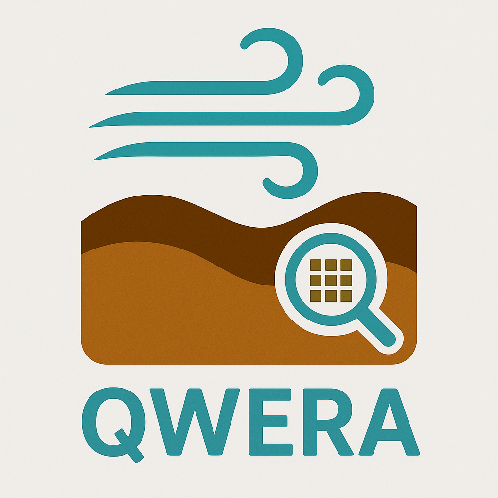
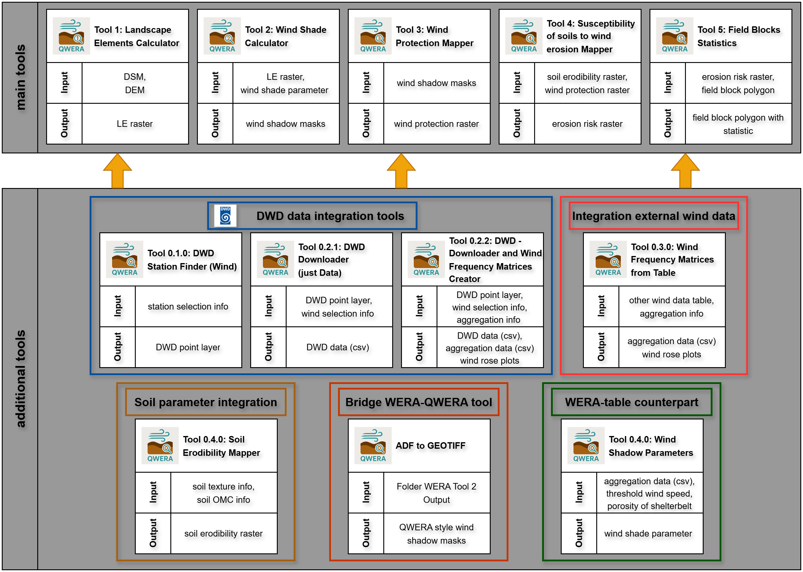

# QWERA Toolbox (QGIS)

Open-source QGIS toolbox for Wind Erosion Risk Assessment (WERA)

**QWERA (QGIS Wind Erosion Risk Assessment)** is an open-source QGIS Processing toolbox
for spatial wind erosion risk assessment with explicit consideration of landscape
structures.

The toolbox implements the **WERA methodology** developed by Funk & Völker
(2023, 2024), which operationalizes **DIN 19706**, in a fully transparent,
reproducible, and non-proprietary QGIS environment.

QWERA was developed as part of a **Master’s thesis** and aims to provide a
scientifically sound reference implementation of WERA in QGIS using only
open-source components. 

Tools cover: data acquisition from DWD, topography-based wind shelter modeling, 
soil erodibility mapping following DIN 19706, and the derivation of wind-erosion 
susceptibility and field-level risk shares. All modules are fully integrated in QGIS 
and tested for version 3.44 (Solothurn). This version is free of heavy dependencies.

---

## Overview

Wind erosion is a highly directional process controlled by wind climatology,
terrain exposure, soil properties, and landscape structure.
QWERA follows the conceptual definition:

**Wind erosion risk = Hazard × Exposure**

and implements this logic through a modular, GIS-based workflow.

---

## Toolbox structure

The QWERA toolbox is organized into additional tools (data preparation) and a main workflow (Tools 1–5).

---

## Installation (ZIP-based)

1. Download the latest release ZIP from the **Releases** section of this repository
2. Open QGIS
3. Navigate to **Plugins → Manage and Install Plugins → Install from ZIP**
4. Select the downloaded ZIP file and install the plugin
5. Enable the plugin if required
6. Open the **Processing Toolbox** to access all QWERA tools

---

## Example workflow

---

## Documentation

The full user manual and detailed technical documentation are provided in the
`docs/` directory.

👉 Start here: [`docs/index.md`](docs/index.md)

Version history and changes are documented in [CHANGELOG.md](CHANGELOG.md).

---

## References

Funk, R. & Völker, L. (2024):  
*A GIS-toolbox for a landscape structure based Wind Erosion Risk Assessment (WERA).*  
MethodsX, 13, 103006  
https://doi.org/10.1016/j.mex.2024.103006

Funk, R., Völker, L. & Deumlich, D. (2023):
*Landscape structure model based estimation of the wind erosion risk in Brandenburg, Germany.*
Aeolian Research, 62, 100878
https://doi.org/10.1016/j.aeolia.2023.100878

DIN (2013):
*DIN 19706:2013-02, Bodenbeschaffenheit – Ermittlung der Erosionsgefährdung von Böden durch Wind.*
DIN Media GmbH, Berlin.

Deutscher Wetterdienst (2025):
*Wetter und Klima – Deutscher Wetterdienst – Startseite.*
https://www.dwd.de/DE/Home/home_node.html (abgerufen am 24.11.2025)

---

## Citation

If you use the QWERA toolbox in scientific work, please cite:

Underlying WERA publications:

- Funk, R. & Völker, L. (2024): *A GIS-toolbox for a landscape structure based Wind Erosion Risk Assessment (WERA).* MethodsX, 13: 103006. https://doi.org/10.1016/j.mex.2024.103006
- Funk, R., Völker, L. & Deumlich, D. (2023): *Landscape structure model based estimation of the wind erosion risk in Brandenburg, Germany.* Aeolian Research, 62: 100878. https://doi.org/10.1016/j.aeolia.2023.100878

DIN reference:
- DIN 19706:2013-02, Bodenbeschaffenheit – Ermittlung der Erosionsgefährdung von Böden durch Wind.

QGIS Plugin development: 

- Schultz, J. (2026). QWERA Toolbox: Open-source QGIS tools for Wind Erosion Risk Assessment (v0.3.0). Zenodo. https://doi.org/10.5281/zenodo.18337036

---

## License

- **Source code**: GNU General Public License v3.0 or later (GPL-3.0-or-later)  
  See `LICENSE`.

- **Documentation and scientific descriptions**:  
  Creative Commons Attribution 4.0 International (CC BY 4.0)  
  See `LICENSE-DOCS`.