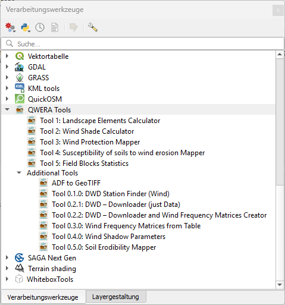

# Installation

## Requirements
- QGIS 3.28 – 3.44 (tested primarily with QGIS 3.44)
- Windows 11 (Linux/macOS not tested)

## Installation from ZIP
1. In QGIS, open **Plugins → Manage and Install Plugins → Install from ZIP**
2. Select the QWERA toolbox ZIP file and click **Install Plugin** (do not unzip)
3. Enable the plugin and open the **Processing Toolbox** to access all QWERA tools

If the toolbox is not visible after restarting QGIS, re-enable it in the plugin manager.

## Dependencies
All dependencies are packed within the plugin ZIP; no additional libraries are required after installation.
