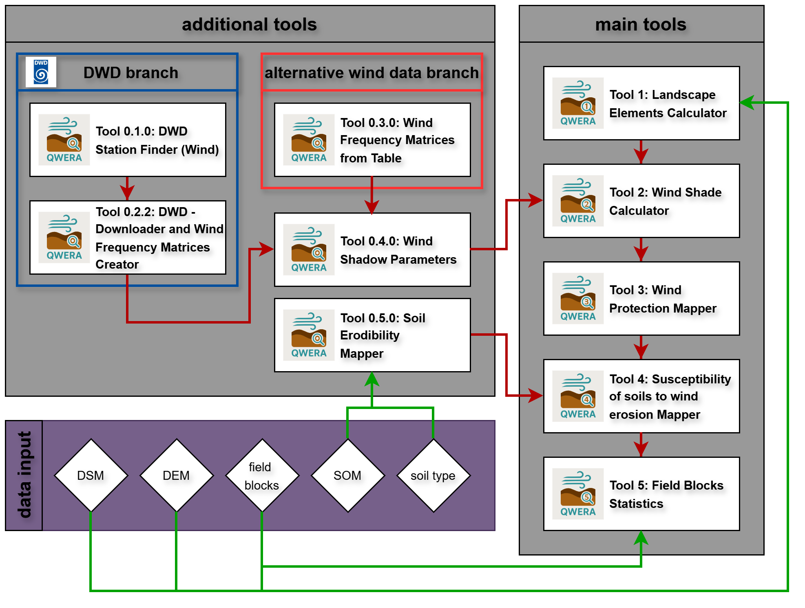

# Example Workflow

The figure below summarizes an end-to-end example workflow in QWERA.

## Step-by-step (short)

1. **Wind Data**
   - Use *DWD Stations Finder* to select nearby stations
   - Download hourly data with *DWD Downloader*
   - Derive frequency matrices via *DWD – Downloader and Wind Frequency Matrices Creator*
2. **Wind Statistics & Shadow Parameters**
   - Use the custom aggregated wind matrix to compute azimuth/altitude via *Wind Shadow Parameters*
3. **Terrain preparation**
   - Compute the landscape elements raster with *Tool 1*
4. **Wind shading**
   - Run *Tool 2* (may take hours depending on resolution/extent and number of directions)
5. **Wind protection map**
   - Aggregate windshade results with *Tool 3*
6. **Soil component**
   - Generate erodibility raster with *Soil Erodibility Mapper*
7. **Integration**
   - Combine erodibility and protection in *Tool 4*
8. **Field risk assessment**
   - Compute polygon statistics with *Tool 5*
